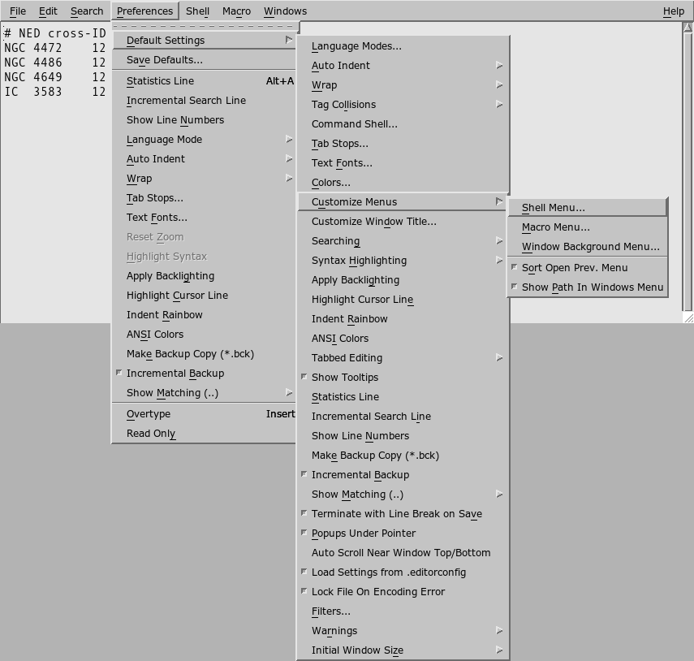
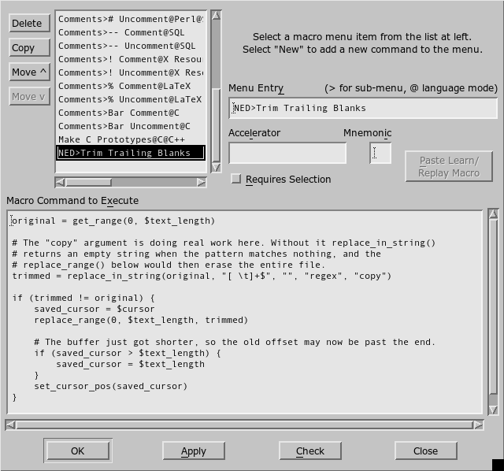
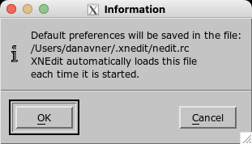
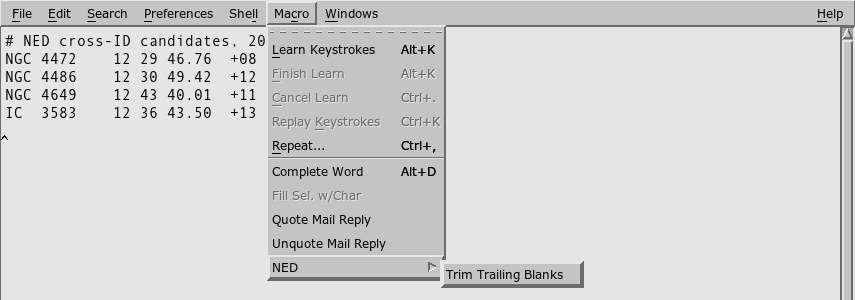

# Installing macros

This repo holds two kinds of macro, and they install differently. Picking the
wrong one is the usual reason a new macro never shows up.

| Kind | Where it comes from | Where it ends up |
| --- | --- | --- |
| **Menu command** | `macros/commands/` | The **Macro** menu, and the right-click menu when the header asks for it |
| **Subroutine library** | `macros/lib/` | `~/.xnedit/autoload.nm`, callable from other macros, invisible in every menu |

Menu commands are the common case, and every one in this repo is in a single
file that installs in one go. Start there. The dialog route further down is for
writing a command of your own or editing one, which is also what the
screenshots show.

## Install every command at once

XNEdit reads menu commands from a file, and every command in this repo is in
one: [nedkit-macros.rc](nedkit-macros.rc){ download }. Downloading it and
importing it installs the lot, and it is the route
[getting started](getting-started.md) uses.

```sh
xnedit -import ~/Downloads/nedkit-macros.rc
```

Then **Preferences > Save Defaults** in the window that opens. The imported
commands are *merged* into whatever you already have, matched on the menu path,
so this will not clobber your own macros.

### Updating or reinstalling after a macro changes

Import the file again, then **Preferences > Save Defaults** as before. Entries
are matched on the menu path, so one that is already installed is replaced
rather than added, and a regenerated file updates the commands in place instead
of leaving you with two of each. Do it after every change to the macros. A
subroutine library behaves the opposite way: appending one to `autoload.nm` a
second time defines everything in it twice.

A renamed command is the exception, and what you see is two commands with
almost the same name, the old one still doing the old thing. The match is on
the menu path and nothing else, so a command whose **Menu Entry** changed
arrives as a new one and the old name stays in the menu running the body it
had. Save Defaults then writes both out.

No import can remove the old entry, so delete it yourself through
**Preferences > Default Settings > Customize Menus > Macro Menu**. The list
down the left of [that dialog](#3-fill-in-the-form) holds every command
installed: select the old name, click **Delete**, then **OK**, and
**Preferences > Save Defaults** to make it stick.

### What is in the file

The file holds two resources rather than one, `nedit.macroCommands` for the
**Macro** menu and `nedit.bgMenuCommands` for the right-click menu, in the
identical format. One `-import` reads both, which is how Pipe at Columns and
Pipe at Cursor Column reach both menus in a single pass. An entry looks like
this:

```
nedit.macroCommands: \
	NED>Trim Trailing Blanks:::: {\n\
		original = get_range(0, $text_length)\n\
		trimmed = replace_in_string(original, "[ \\t]+$", "", "regex", "copy")\n\
		if (trimmed != original) {\n\
			replace_range(0, $text_length, trimmed)\n\
		}\n\
	}\n
```

The format is unforgiving:

| Part of an entry | Rule |
| --- | --- |
| The four fields before the body | Menu path, accelerator, mnemonic, flags, separated by colons. `R` in the flags field means the command requires a selection, and an empty field still needs its colon, hence `::::` |
| Every line of the body | Ends with a literal `\n\`, an escaped newline followed by the resource file's line continuation |
| The last line of the resource | Ends with `\n` and no trailing backslash |
| Indentation | Tabs, not spaces |
| Backslashes | They double. A macro containing `"[ \t]+$"` is written `"[ \\t]+$"` here, and `"\\w"` becomes `"\\\\w"` |

Because of that backslash rule especially, don't hand-write these.
`tools/gen_docs.py` writes `docs/nedkit-macros.rc` from the macro files, which
is why the download stays in step with them, and a test fails if the committed
copy drifts.

Writing the same resource straight into `~/.xnedit/nedit.rc` looks like the
same thing and is not. Preferences are read from one source per setting, so a
file naming `nedit.macroCommands` replaces XNEdit's own built-in macro
commands, Complete Word and the Comments submenu among them, rather than
joining them. Only `-import` merges.

## Install one command through the dialog

The route for a single command: one you are writing yourself, one you want to
change after installing it, or one of the nine when you do not want the other
eight. Nothing in it needs a Terminal. The example below installs
`macros/commands/trim-trailing-blanks.nm`.

### 1. Copy the macro body

Open the `.nm` file in any editor. The header comment tells you what to type
into each field of the dialog. Everything below the header is the macro body:
select it and copy it.

### 2. Open the Macro Commands dialog

**Preferences > Default Settings > Customize Menus > Macro Menu...**



### 3. Fill in the form

`New` sits at the top of the list on the left and is already selected when the
dialog opens, which is what you want for a new command. Fill in the right-hand
side from the file's header comment, and paste the body into **Macro Command to
Execute**.



*The dialog once the command has been filled in. Until you add it, the list on
the left ends at `New` and the fields on the right are empty.*

| Field | What goes in it |
| --- | --- |
| **Menu Entry** | The menu path. `NED>Trim Trailing Blanks` puts the command in a `NED` submenu; each `>` adds a level. |
| **Accelerator** | Optional keyboard shortcut. Click the field and press the keys themselves, don't type their names. |
| **Mnemonic** | Optional single letter, which must appear in the item's name. Underlines that letter for keyboard navigation. |
| **Requires Selection** | Tick only if the header comment says a selection is required. The command is then greyed out when nothing is selected. |
| **Macro Command to Execute** | The body you copied. |

The header carries one field this dialog has no box for: **Install In**, the
list of menus the command belongs in. Anything naming `Window Background Menu`
needs a second trip through Customize Menus, described below.

**Check** compiles the macro and reports any syntax error without installing
anything. Click it before you commit to the command. Then **OK**, which applies
the command and closes the dialog.

### 4. Save the defaults

**Preferences > Save Defaults**, then **OK**.



The new command works immediately, but it lives only in the running program
until you do this. Save Defaults is what writes it to `~/.xnedit/nedit.rc`.

### 5. Check the menu



Test it on a copy of a real file before you trust it on anything you care
about. Macros write straight to the buffer with no confirmation step.

## Install a background menu command

Right-clicking in the text opens the window background menu, the short one
holding Undo, Redo, Cut, Copy and Paste. A command whose header names
`Window Background Menu` under **Install In** belongs there as well, which puts
it one click from the text it acts on.

It is a different dialog from the one above, which is the step people miss:

**Preferences > Default Settings > Customize Menus > Window Background
Menu...**

The form is the one you have already filled in, minus the Requires Selection
box. Paste the same body, click **Check**, then **OK**, then **Preferences > Save Defaults**. A command that belongs in both menus gets installed twice,
once through each dialog, and the two copies are independent: editing one does
not touch the other.

Undo, Redo, Cut, Copy and Paste survive that. They are the default value of the
`nedit.bgMenuCommands` resource, and both the dialog and `-import` add to the
list rather than replacing it. Writing `nedit.bgMenuCommands` into
`~/.xnedit/nedit.rc` by hand is what loses them, since the menu is then exactly
the entries on that line.

### Right-clicking does not move the cursor

Worth knowing before running Pipe at Cursor Column that way. Posting the
background menu leaves the insert cursor wherever it already was, so left-click
the column you mean first, then right-click.

## Install a subroutine library

Files in `macros/lib/` define subroutines that other macros call. They add
nothing to any menu, and they install by being appended to `autoload.nm`, which
XNEdit runs at startup. Run it from the top of a clone, which
[getting started](getting-started.md#getting-the-repository) covers:

```sh
cat macros/lib/text.nm >> ~/.xnedit/autoload.nm
```

XNEdit does not create `autoload.nm` for you, but `>>` will. Restart XNEdit
afterwards, then check it loaded by running one of its subroutines from
**Macro > Execute Macro**.

Appending the same file twice defines the same subroutines twice, so
reinstalling a library after an edit means deleting the old block first.
Menu commands work the other way round, and [updating or reinstalling after a
macro changes](#updating-or-reinstalling-after-a-macro-changes) has that case.

## Where XNEdit keeps things

`~/.xnedit/`, created on first run:

| File | Holds |
| --- | --- |
| `nedit.rc` | All preferences, including every Macro menu command, in X resource format |
| `autoload.nm` | Macro code run at startup. Not created for you |
| `nedit.history` | Recently opened files |

Setting `XNEDIT_HOME` moves the whole directory:

```sh
echo "${XNEDIT_HOME:-$HOME/.xnedit}"
```

Note the leading `X`. Classic NEdit used `NEDIT_HOME`; XNEdit does not read it.

XNEdit runs locally on XQuartz on the team's Macs, so this is your own machine.
Nothing here involves a remote host.

## Coming from classic NEdit

XNEdit uses NEdit 5.7's preferences format and the same `nedit` X resource
app-name, so existing settings transfer as they are:

```sh
cp -r ~/.nedit/. ~/.xnedit/
```

Fonts are the exception and will need setting again, since XNEdit renders
antialiased text.

## Troubleshooting

| What you see | Why, and what to do |
| --- | --- |
| The dialog will not take a paste | Use **Ctrl+V**, not Cmd+V. XNEdit binds Ctrl+V to paste on every text field in the program, through a fallback resource rather than through any menu, so it works in dialogs that have no Edit menu of their own. Or skip the dialog and import the file |
| The **Accelerator** field will not take a paste either, or any typing | That one is deliberate. XNEdit strips the field of its ordinary key handling so it can record the keystroke you press, which is why the way to fill it in is to press the keys themselves |
| The command is not in the menu | It went into `autoload.nm` instead. That file defines subroutines and creates no menu entries |
| It is in the Macro menu but not on right-click | Those are two dialogs, not one. Customize Menus > Macro Menu... fills the Macro menu, Customize Menus > Window Background Menu... fills the right-click menu, and a command belonging in both is pasted into both |
| It was there yesterday and now it is gone | Save Defaults was skipped |
| Two commands with almost the same name, and the old one still does the old thing | The command was renamed. An import matches on the menu path, so the new name arrived as a new command and the old one stayed behind with its old body. [Delete the old entry](#updating-or-reinstalling-after-a-macro-changes) |
| It works for you and for nobody else | It calls a subroutine from `autoload.nm` that only you have installed |
| The command is greyed out | Requires Selection is ticked and nothing is selected |
| Nothing happens and there is no error | Start XNEdit from a terminal and put `t_print()` calls in the macro. That output goes to the terminal, not to any window |
| It says the file is locked, so nothing was changed | A locked buffer takes no writes, so the command stopped before doing anything. XNEdit locks a file it cannot read as UTF-8, which on NED data is the usual reason |

[When the file is locked](cleaning-pdf-tables.md#when-the-file-is-locked) goes
through the rest of what the window is telling you on that last one, including
how to get the buffer unlocked.
